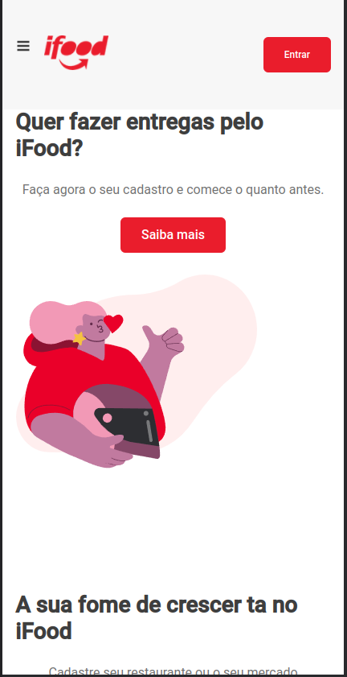

#README

# iFood clone nextjs




## O que foi usado?

Este projeto usa muitas coisas como:

- [TypeScript](https://www.typescriptlang.org/)
- [NextJS](https://nextjs.org/)
- [Styled Components](https://styled-components.com/)
- [Jest](https://jestjs.io/)
- [React Testing Library](https://testing-library.com/docs/react-testing-library/intro)
- [Storybook](https://storybook.js.org/)


## Começando

Primeiro, execute o servidor de desenvolvimento:

```bash
npm run dev
# ou
yarn dev
```


- `dev`: executa seu aplicativo em `localhost:3000`
- `build`: cria a versão de compilação de produção
- `start`: inicia um servidor simples com o código de produção da compilação
- `test`: executa jest para testar todos os componentes e páginas
- `test:watch`: executa jest no modo de watch (para monitorar as alterações nos testes em tempo real)
- `storybook`: rodar storybook em `localhost:6006`
- `build-storybook`: criar a versão de compilação do storybook
- `build-storybook-docs`: criar a versão de compilação do storybook documents
- `storybook:serve`: rodar o storybook compilado em um http server na porta 6006

## Deploy on Netlify

Projeto [kelvi-ifood-clone
](https://kelvi-ifood-clone.netlify.app)

Documentação [kelvi-ifood-clone-docs](https://kelvi-ifood-clone-docs.netlify.app)